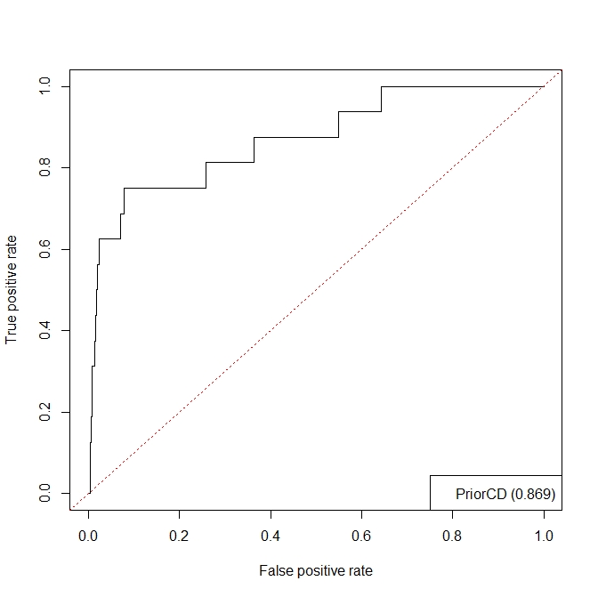
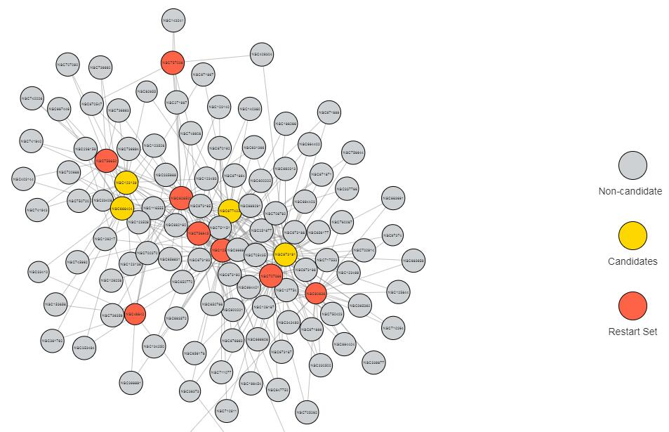

```{r setup, include = FALSE}
knitr::opts_chunk$set(
  collapse = TRUE,
  comment = "#>"
)
```

## 1 Introduce
This vignette illustrates how to easily use the PriorCD package. With the use of functions in this packages, users could obtain prioritizing list of candidate drugs and detailed information about it.

+  This package provides the `prior` function to prioritize candidate drugs against interested cancer.

+   This package provides the `drsim` function to convert correlation matrix into binary drug similarity adjacency mattrix.

+  This package provides the `getROC` function to calculate AUC and plot ROC curve of your result. 

+  This package provides the `getDNN` function to show the network sturcture of the therapeutic drugs used to prioritize and drug candidates that have been prioritized.


## 2 Example: Prioritize candidates for drug repurposing and obtain detailed information about them
We can use function getData to return example data and environment variables.

```{r echo = T, results = 'hide'}
library(PriorCD)
e <- getData("drug.edgelist") #Get the two-column edge list of drug functional similarity network
brc <- getData("breast_cancer") #Get the FDA-approved drugs for breast cancer
#priorlist <- prior(e, brc, times = 5) #Prioritize drug. Times is 5 here, normally it should be set to 1000.
```

The prioritizing list looks like this: 

```{r echo = F}
priorlist<-getData("priorlist")
head(priorlist)
```

The list shown above is the detailed information of prioritizing list, which include NSC ID, drug name, prioritizing score, p-value, FDR, status and mechanisms of action (MOA).

Besides, you can also get the AUC value and ROC curve of the results.

```{R}
#getROC(e, brc, file=file.path("../inst/tempdir", "ROC.pdf"))
```
```{R}

```
Moreover, you can browse the network structure of the candidate drugs and the therapeutic drugs.

```{R}
candidates <- getData("brc_candidates")
getDDN(e, brc, candidates)
```

And then you will get a HTML web page, click it and the page just looks like:

```{r echo = F, out.width = "95%"}

```

## 3 Example: Convert drug correlation matrix into binary drug similarity matrix

```{r results='hide'}
library(PriorCD)
r <- getData("drug.r") #Get example drug correlation matrix
fdr <- getData("drug.fdr") #Get example fdr matrix of drug correlation
m <- drsim(r, fdr, top = 0.5) #Convert into binary drug similarity matrix. top is determined by the number of drugs you want to leave.
```

The converted matrix looks like this:
```{r echo = F}
m
```
